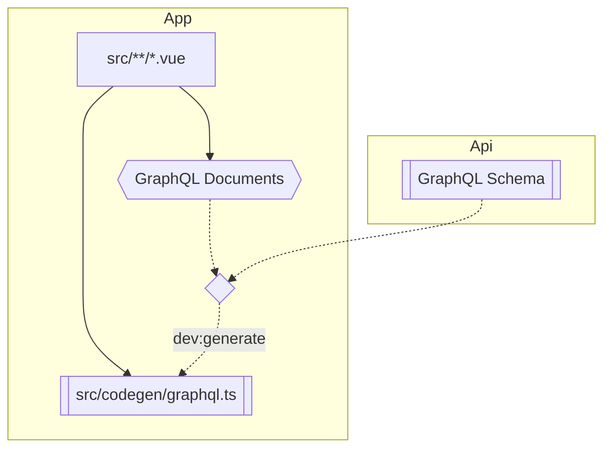

# OpenSkool App

## Development

Run `yarn workspace @os/app dev` to start the api in development mode.

### Icons

We use [Remix Icon](http://remixicon.com/) and [unplugin-icons](https://github.com/antfu/unplugin-icons)
to easily add icons to our App.

Find your prefered icon in the Remix Icon search and insert into the App as follows.

```vue
<script>
import Home4Line from '~icons/ri/home-4-line';
</script>
<template>
  <home-4-line />
</template>
```

### Type-safety

Thanks to GraphQL we have end-to-end type-safety.



#### Source files

- `src/**/*.vue`: Our App code which contains GraphQL Documents that describe how we query the API.
  - Use `dev:generate` to generate TypeScript types that match our documents. This is done automatically and continuously when running the App during development.

#### Generated files

- `src/codegen/graphql.ts`: TypeScript types based on the Api's GraphQL Schema and our App's GraphQL Documents.
